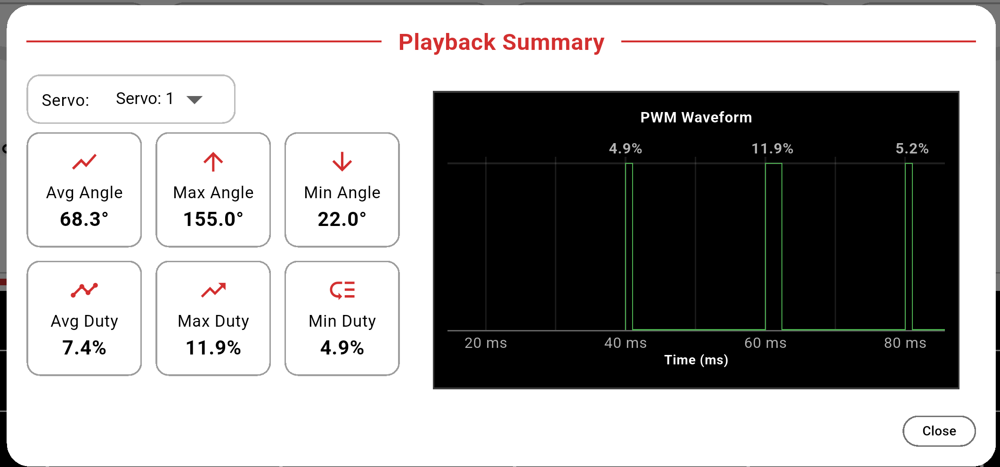

  

<h1 align="center">Google Summer of Code 2025 – Final Report</h1>

## Personal Information
- **Name:** Rahul Das
- **GitHub:** [Rahul](https://github.com/rahul31124)  
- **Project Title:** Robotic Arm Control for PSLab
- **Organization:** [FOSSASIA](https://github.com/fossasia)  

## Mentors
- [Alexander Bessman](https://github.com/bessman)
- [Padmal](https://github.com/CloudyPadmal)
- [Marc Nause](https://github.com/marcnause)

---
## Project Overview
This project aims to add a **Robotic Arm Control feature** (supporting up to **4 Degrees of Freedom**) to the new **PSLab mobile app** and the **PSLab Python library**, enhancing their capabilities with advanced features that go beyond basic manual servo control.

On the **App side**, I designed and implemented a new control screen that allows users to connect their robotic arm to the PSLab device and operate it in two distinct ways.  

First, there’s a **manual mode** with circular sliders for each servo, providing smooth, fine-tuned control over movements.  
Second, there’s an **automated timeline mode**, where users can visually create and edit sequences of movements that the arm will execute automatically.  

At the end of each automated run, the app now presents a **playback summary**.  
This summary includes:
  - A detailed **PWM graph** visualizing the entire motion sequence
  - Key statistics such as maximum, minimum, and average **angle** reached during the run
  - Maximum, minimum, and average **duty cycle (%)** used

These additions make it easier to understand the arm’s behavior, verify motion logic, and debug any issues.

I also added a dedicated **control panel** that provides key customization options for operating the robotic arm:
- Setting the total timeline length
- Choosing an operating frequency (e.g., 50 Hz or 100 Hz)
- Defining a maximum allowable angle for safety
- Enabling haptic feedback at each second to give tactile confirmation during playback

Additionally, I added an **in-app connection guide** with a PNG image to help users correctly connect their robotic arm to the PSLab device.

---

For the **Python library**, I created a dedicated **`RoboticArm`** class that mirrors the functionality of the mobile app.  
With this, users can programmatically define and execute timelines directly from Python scripts.  

I also added the ability, in **both the mobile app and the Python library**, to:
- Export timelines as CSV files
- Import timelines from CSV files  

This ensures **cross-platform compatibility**, effectively bridging the gap between mobile and Python environments.

---

To make the feature accessible, I also updated the **official PSLab documentation**, adding:
  - Step-by-step detailed instructions
  - Demonstration videos
  - Python code snippets
    
[PSLab Robotic Arm Documentation](https://docs.pslab.io/tutorials/roboticarm)

---

## Work 

### Mobile App 
| Pull Request | Status |
| ------------ | ------ |
| [#2729](https://github.com/fossasia/pslab-app/pull/2729) |  |
| [#2752](https://github.com/fossasia/pslab-app/pull/2752) |  |
| [#2776](https://github.com/fossasia/pslab-app/pull/2776) |  |
| [#2763](https://github.com/fossasia/pslab-app/pull/2763) |  |
| [#2791](https://github.com/fossasia/pslab-app/pull/2791) |  |
| [#2762](https://github.com/fossasia/pslab-app/pull/2762) |  |
| [#2801](https://github.com/fossasia/pslab-app/pull/2801) |  |
| [#2807](https://github.com/fossasia/pslab-app/pull/2807) |  |

---

### Python Library
| Pull Request | Status |
| ------------ | ------ |
| [#255](https://github.com/fossasia/pslab-python/pull/255) |  |
| [#256](https://github.com/fossasia/pslab-python/pull/256) |  |

---

### Documentation
| Pull Request | Status |
| ------------ | ------ |
| [#187](https://github.com/fossasia/pslab-documentation/pull/187) |  |

---
### Screenshots

| **Robotic Arm Screen** | **Control Panel** |
|------------------------|-------------------|
|  |  |

| **Playback Summary** | **Connection Guide** |
|----------------------|----------------------|
|  |  |

---
## Challenges & Learnings
- Designing a **responsive UI** adaptable to multiple screen sizes
- Synchronizing **servo PWM signals** accurately with the timeline for smooth motion
- Ensuring **CSV import/export** works seamlessly across both mobile and Python platforms
- Gaining hands-on experience and deeper understanding of **hardware integration**, including servo motor control, PWM signal generation, duty cycle tuning, and their impact on precise joint movements

---
## Future Work
I am looking forward to continuing my contributions to PSLab by adding new features, improving existing functionality, and addressing any issues that arise.

## Acknowledgements
Special thanks to:
- My mentors at **FOSSASIA**
- The **PSLab community** for their constant support, guidance, and encouragement throughout the project
- **Google Summer of Code** for this amazing opportunity

